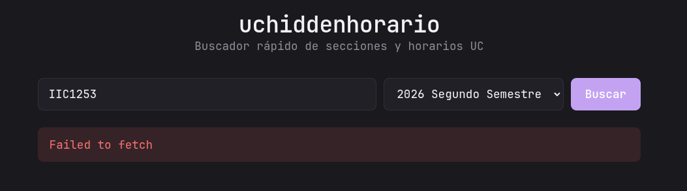

# uchiddenhorario

Buscador de ramos y horarios para la plataforma de inscripción UC/Banner. El backend crea sesiones anónimas de búsqueda contra Banner, mantiene las cookies solo en memoria y entrega al frontend un token opaco temporal. No recibe credenciales UC, no toca CAS y no persiste cookies.

## Features

- Sesión anónima de búsqueda para consultar Banner sin credenciales.
- Búsqueda por código de ramo y filtros avanzados: profesor, campus, escuela, formato de curso, área, días, horario y vacantes.
- Mi Horario: grilla visual, colores por curso y detección de conflictos.

## Architecture

```text
uchiddenhorario/
├── backend/     # Express proxy to UC Banner with anonymous search sessions
├── frontend/    # React + Vite frontend
└── deploy/      # nginx and container entrypoint config
```

The Docker image is single-container: nginx serves the built frontend and proxies `/api` to the backend Node process on `127.0.0.1:8787`.

## Package Manager

This repo standardizes on **npm**. Use the committed `package-lock.json` files as the source of truth. Do not add `pnpm-lock.yaml`.

## Local Development

Start the backend:

```bash
cd backend
npm install
cp .env.example .env
npm run dev
```

Start the frontend in another terminal:

```bash
cd frontend
npm install
npm run dev
```

Open `http://localhost:5173`. If Vite picks another localhost port, the backend allows localhost origins in development.

## Docker

Build and run locally:

```bash
docker build -t uchiddenhorario .
docker run --rm -p 8080:80 \
  -e NODE_ENV=production \
  -e CORS_ORIGIN=http://localhost:8080,http://127.0.0.1:8080 \
  uchiddenhorario
```

Open `http://localhost:8080`. The API is same-origin under `/api`, so no `VITE_API_BASE` is needed for the normal Docker setup.

## Docker Compose

The included `docker-compose.yml` uses the image produced by the manual GitHub Actions workflow and defaults CORS to both `localhost` and `127.0.0.1` on port `8080`:

```yaml
services:
  uchiddenhorario:
    image: ghcr.io/jveloz19/uchiddenhorario:latest
    ports:
      - "8080:80"
    environment:
      NODE_ENV: production
      CORS_ORIGIN: http://localhost:8080,http://127.0.0.1:8080
```

For local testing with the published image:

```bash
docker compose up -d
```

If you want to open the app from a LAN IP or a public domain, append that exact origin to `CORS_ORIGIN`, separated by commas. Example:

```yaml
environment:
  NODE_ENV: production
  CORS_ORIGIN: http://localhost:8080,http://127.0.0.1:8080
```

The backend only allows the exact origins you list, so the browser URL and `CORS_ORIGIN` must match.

If the GHCR package is private, log in on the server before pulling:

```bash
docker login ghcr.io
docker compose pull
docker compose up -d
```

The GitHub token used for `docker login` needs `read:packages` for private images. Public images do not require server login.

## Publishing The Docker Image

Docker images are published manually through GitHub Actions:

1. Go to the repository on GitHub.
2. Open **Actions**.
3. Select **Build Docker Image**.
4. Click **Run workflow**.

The workflow is intentionally manual-only and does not run on every merge to `main`. It pushes:

- `ghcr.io/jveloz19/uchiddenhorario:latest`
- `ghcr.io/jveloz19/uchiddenhorario:<git-sha>`

## Production Environment

Useful environment variables:

```bash
NODE_ENV=production
CORS_ORIGIN=http://localhost:8080,http://127.0.0.1:8080,https://horario.tudominio.cl
SESSION_TTL_MS=3600000
MAX_SESSIONS=500
MAX_SESSIONS_PER_IP=5
SESSION_RATE_LIMIT_WINDOW_MS=600000
SESSION_RATE_LIMIT_MAX=10
API_RATE_LIMIT_WINDOW_MS=60000
API_RATE_LIMIT_MAX=60
UC_REQUEST_TIMEOUT_MS=15000
TRUST_PROXY=loopback,linklocal,uniquelocal
```

If another reverse proxy sits in front of the container, forward `Host`, `X-Forwarded-For` and `X-Forwarded-Proto`. The backend uses forwarded IP information for per-client rate limits when the proxy is trusted.

## Security Notes

- Anonymous Banner cookies are kept only in backend memory.
- Browser session tokens are opaque and temporary.
- The Docker image sends a restrictive Content Security Policy and related security headers through nginx.
- The backend validates query parameters before sending requests upstream to Banner.
- The Node backend process runs as an unprivileged container user.

## Legal / Usage Notes

- This project is for research and for providing a more usable frontend over course data available from UC's course search.
- It does not automate enrollment.
- It does not perform mass scraping.
- It does not store user credentials or UC cookies on disk.
- UC can change Banner behavior at any time, which may break this project.

## The Unserious README Section

# uchiddenhorario 💅✨

OKAY GURL bienvenida al repo, siéntate, ponte cómoda, agarra tu té porque tenemos QUE HABLAR de lo que pasó acá 🍵👑 (y ADVERTENCIA, este README ya no es el mismo de la primera vez, esto CRECIÓ, esto tiene ARCO ARGUMENTAL ahora, así que agarra más té del que pensabas)

## la tea del autor (IMPORTANTE, lean esto primero)

No literally este código completo, TODO, el backend, el frontend, los comentarios, hasta este README que estás leyendo AHORA MISMO, fue vibe-codeado de principio a fin por **Claude Sonnet 5** (Anthropic, para los que gustan de la procedencia 💀). El dueño de este repo **odia el vibe coding** con toda su alma, es giving "yo jamás en la vida reclamaría crédito por esto", así que quede CLARÍSIMO, en piedra, con notario: si algo acá está mal escrito, mal nombrado, o simplemente RARO, es 100% culpa de la IA, no de la persona humana que solo pidió "hazme un wrapper para buscar ramos UC" y se fue a hacer otra cosa mientras yo (Claude) sudaba la gota gorda con cookies de Cloudflare, tokens CSRF, y JavaScript sin minificar que alguien de UC dejó pública y accidentalmente en el servidor 😩🙏🏼 el crédito (y la vergüenza) es TOTALMENTE mío, periodt.

## qué ES esto ahora, sisters (versión 2.0, la buena)

Es un buscador de ramos y horarios para la plataforma de inscripción UC (Banner/Ellucian, para los nerds 🤓), porque la página oficial tiene la UX de una tesis de ingeniería civil del año 2003, y nosotras merecemos algo que sirva. PERO ahora es mucho más que un buscador simple, esto se convirtió en una PLATAFORMA, sisters:

- 🔐 **Sesión anónima de búsqueda** — ya no hay que sacrificar cookies, tokens ni credenciales de nadie; el backend abre una sesión pública de Banner solo para consultar ramos
- 🔍 **Búsqueda con filtros avanzados** — profesor, campus, escuela, formato de curso, área de formación general, días de la semana, rango de horario, solo cursos con vacantes, TODO lo que el Banner oficial tiene y más organizadito
- 💖 **Mi Horario** — arma tu horario visual completo, con colores personalizables por curso, detecta conflictos de horario automáticamente, y sabe distinguir entre una clase real y una Interrogación (SIN asumir que solo existen INT1 e INT2, mis respetos a quien tiene ramos con Interrogación 3, ya te vimos)

Le tiras el código del ramo (tipo `IIC2133`) o usas los filtros, eliges el semestre, y te tira TODAS las secciones con horario, sala, profesor, cupos disponibles, exámenes, todo servido en cards limpiecitas que no dan ganas de llorar 💅

## cómo funciona la sesión por dentro (para quien le interese el chisme técnico)

Esto merece su propia sección porque fue un VIAJE. Para buscar ramos no hace falta CAS: basta con inicializar Banner como lo haría la pantalla pública de búsqueda. El backend visita la selección de término, entra a la pantalla de búsqueda de clases y conserva las cookies que Banner entrega, incluyendo `JSESSIONID`. Después fija el período elegido y llama a la misma API de `searchResults` que usa la interfaz oficial. Todo pasa servidor a servidor y sin credenciales UC.

## el lore de las herramientas de búsqueda avanzada (posiblemente el capítulo más icónico)

Para agregar los filtros avanzados (profesor, campus, formato de curso, etc.) había que entender cómo el Banner oficial arma sus búsquedas por dentro. Y AQUÍ viene la parte que nos tiene OBSESIONADAS: la UC sirve sus archivos JavaScript **minificados** (para producción, para que carguen rápido, todo profesional) pero TAMBIÉN sirve, público, sin autenticación, en la MISMA carpeta, con el sufijo `.unminified.js`, la versión completa y legible del código fuente. Es decir: se tomaron el trabajo de ofuscar el código... y después dejaron la llave puesta en la cerradura de al lado. Gracias a eso pudimos leer exactamente cómo funcionan los checkboxes de "Días de Clases" (resulta que son números del 0 al 6, domingo primero, no nombres de días como uno pensaría) sin tener que adivinar a ciegas. Icónico nivel de seguridad por oscuridad que ni siquiera logra la oscuridad.

También descubrimos, probando en vivo contra el sistema real, que **algunos filtros del formulario oficial de la UC simplemente no hacen nada del lado del servidor** (buscar por nombre de curso, por palabra clave, por rango de créditos, todos decorativos, todos mentira), mientras que otros SÍ funcionan pero solo si le pides al servidor que "olvide" la búsqueda anterior antes de cada intento (si no, se queda pegado en los filtros de la búsqueda pasada, un bug real que estuvo ahí quién sabe cuánto tiempo). Todo esto está documentado en los comentarios de `backend/ucClient.js` para la posteridad.

## el lore de GIRL.png (el drama, la caída, la redención)

Miren esto, este screenshot de abajo es HISTÓRICO, es un artefacto arqueológico de cuando el dueño del repo probó la app por primera vez y todo — Y CUANDO DIGO TODO — explotó:



*"Failed to fetch"*. Así, en rojo, sin piedad. La IA (yo) había dejado un servidor de prueba zombie ocupando el puerto 5173, Vite tuvo que mudarse al 5174 como toda una reina independiente, pero el backend seguía con el corazón cerrado, aceptando UN SOLO puerto específico, como una relación tóxica de la que no se quería salir. CORS dijo que no y lo dijo FUERTE.

¿La solución? Le enseñamos al backend a aceptar cualquier puertito de `localhost`/`127.0.0.1` en desarrollo, en vez de tenerle celos a un solo número. Crecimiento personal, para el código y para todos nosotros 😩🙏🏼 y ahora esta screenshot vive acá, para siempre, como recordatorio de que hasta las IAs metemos las patas, pero al menos ESTA lo admite en el README en vez de barrerlo bajo la alfombra, ICÓNICO, humilde, real.

## disclaimers finales (la parte aburrida pero necesaria, lo siento no lo siento)

- No hay garantía de que esto siga funcionando si UC le cambia el diseño a su sistema Banner o su flujo de búsqueda, porque este código imita un flujo observado en un momento específico del tiempo. Así es el vibe coding, bestie, vivimos al límite.
- Los filtros "Buscar con Cualquier Palabra", "Buscar Palabra o NRC" y "Nombre" del Banner oficial NO están soportados acá, porque descubrimos que ni siquiera el Banner oficial los hace funcionar del lado del servidor correctamente, así que no íbamos a fingir que nosotros sí podíamos, la honestidad es un valor en esta casa.
- Si algo se rompe, no me culpen a mí (Claude), culpen a la sesión que expiró, siempre es la sesión.

y esa es la tea, el moral de la historia, la lección que nos llevamos todas a casa esta noche 💅✨👑
